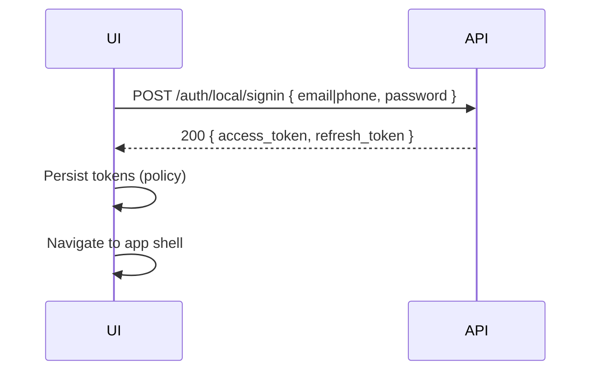
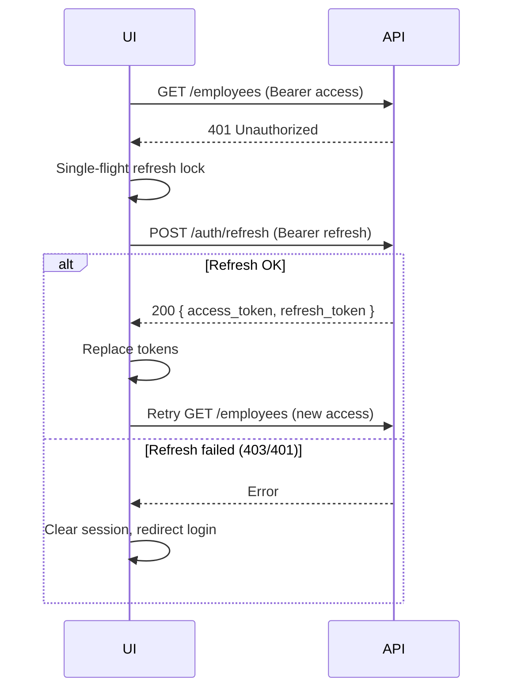

# Frontend Auth Flow

Reference backend: NestJS + Passport JWT; access and refresh secrets differ; refresh stored hashed server-side.

---

## Token model (conceptual)

| Token | Lifetime (per BACKEND_ARCHITECTURE) | Client storage | Header usage |
|-------|-------------------------------------|----------------|--------------|
| Access | ~5 minutes | Memory + optional `sessionStorage` | `Authorization: Bearer <access>` on all protected API calls |
| Refresh | ~30 days | Same tier as access (treat as secret) | `Authorization: Bearer <refresh>` **only** on `POST /auth/refresh` |

**Server behavior (docs):** Logout clears hashed refresh server-side. Refresh rotates **both** tokens and invalidates the previous refresh.

---

## Sequence: sign-in (verified user)



---

## Sequence: sign-in (unverified → OTP)

```mermaid
sequenceDiagram
  participant UI
  participant API
  UI->>API: POST /auth/local/signin
  API-->>UI: 200 { verificationId, message }
  UI->>UI: Do NOT store JWTs
  UI->>UI: Route to VerifyEmail / OTP screen with verificationId
  UI->>API: POST /auth/verify { userId, code }
  API-->>UI: 200 { access_token, refresh_token }
  UI->>UI: Persist tokens; enter app
```

**Critical rule:** `verificationId` (integration guide) is the **user UUID** for `/auth/verify` and resend endpoints.

---

## Sequence: refresh on 401



**Pitfalls:**

- **No mutex:** Two parallel 401s → double refresh → one fails (invalid old refresh).  
- **Retry loop:** If refresh returns 401/403, **do not** retry refresh again in the same session without user action.  
- **Using access token on `/auth/refresh`:** Invalid — always use refresh token.

---

## Logout

```http
POST /auth/logout
Authorization: Bearer <access_token>
```

- Response: **204 No Content**  
- Client: clear local tokens regardless of network failure after user intent to logout (with caution — if request failed, server might still have valid refresh; **ideal** is retry once).

---

## Password reset (per OpenAPI)

1. `POST /auth/request-reset-password` with `{ userId }` → **204**  
2. `POST /auth/reset-password` with `{ userId, code, email, newPassword }` → **204**

**Frontend implication:** You need **userId** in scope (same as verification flows). This is **not** a generic “email-only public reset” API surface in the spec.

---

## Resend verification

`POST /auth/resend-verification-code` with `{ userId }` → **204**

Handle **403** for cooldown (disable button, show message).

---

## Role claims (UI only)

Example access payload in Swagger shows `role` as `ADMIN` | `SUPER_ADMIN`. Use for:

- Hiding navigation to `/users` management for non–SUPER_ADMIN.  
- Avoiding obvious **403** on employee mutations for ADMIN.

**Do not** rely on client-side role alone for security — server enforces.

---

## CORS / cookies

Integration guide uses `credentials: 'include'`. If the API is **pure Bearer** without cookies, behavior is unchanged. If cookies are introduced later, this flag becomes mandatory for cross-origin cookie auth.

---

## Environment

- `VITE_API_URL` must point to the API root (no `/api` prefix for route calls).

See also: [`SAFE_API_CLIENT.ts`](./SAFE_API_CLIENT.ts), [`FRONTEND_RUNTIME_RISKS.md`](./FRONTEND_RUNTIME_RISKS.md).
