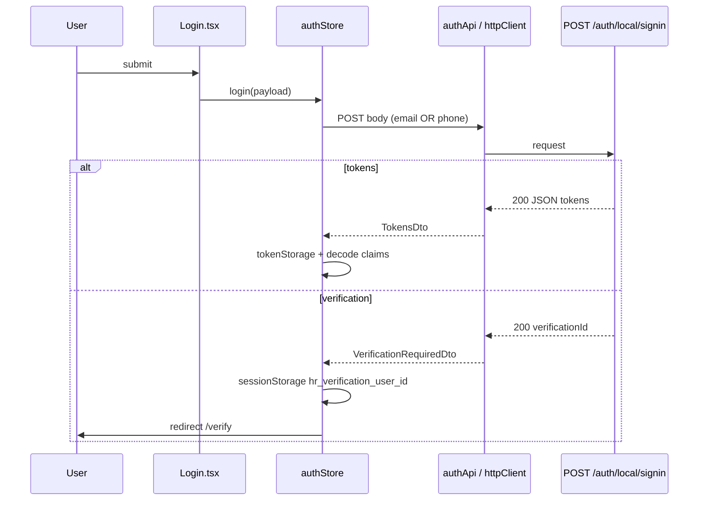
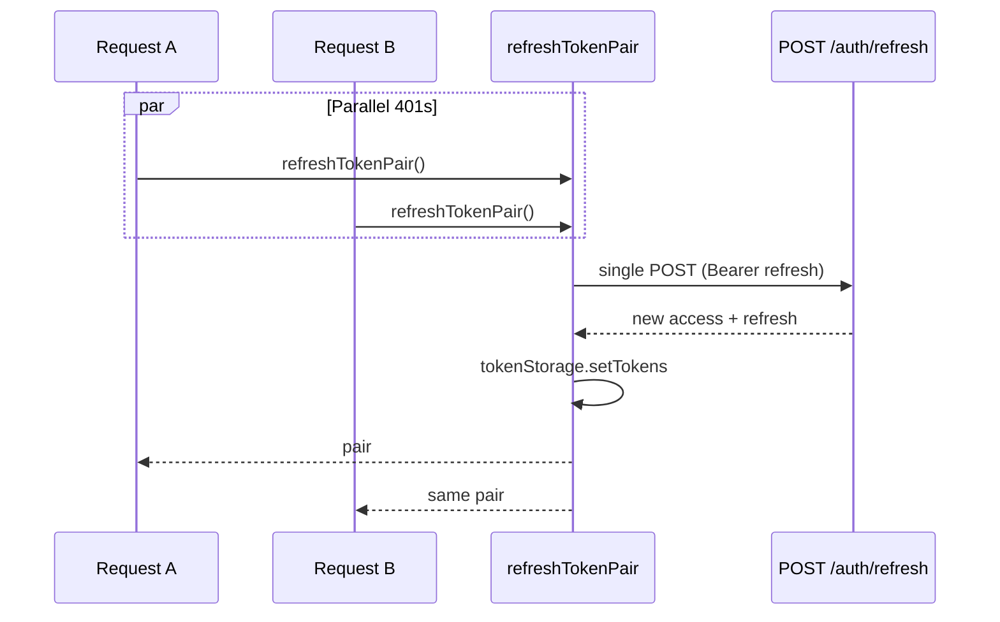

# Authentication Flow — HR Dashboard Frontend

This document explains **how auth works in code**, tied to backend routes from `back/COMPLETE_API_REFERENCE.md` and `back/FRONTEND_INTEGRATION_GUIDE.md`. It highlights **one documented mismatch** between backend behavior and a screen implementation.

---

## 1. Token model (backend contract)

| Token | When sent | Header |
|-------|-----------|--------|
| Access JWT | Most requests | `Authorization: Bearer <access_token>` |
| Refresh JWT | Only `POST /auth/refresh` | `Authorization: Bearer <refresh_token>` |

Access TTL and refresh rotation are **server-defined** (see `back/BACKEND_ARCHITECTURE.md`). The frontend must never send the access token to `/auth/refresh`.

---

## 2. Token storage strategy (`tokenStorage.ts`)

- Keys: `hr_access_token`, `hr_refresh_token`.
- Storage backend: **`localStorage`** unless `import.meta.env.VITE_AUTH_STORAGE === 'session'`, then **`sessionStorage`**.
- Rationale: SPA needs persistence across reloads; session mode trades convenience for reduced persistence on shared devices.

---

## 3. Login flow

**Entry:** `Login.tsx` → `useAuthStore().login({ email | phone, password })`.

**Implementation:** `authStore.login` calls **`authApi.signIn`** (`httpClient`):

- `skipAuth: true` — no access header on sign-in.
- `skipRefresh: true` — a 401 here must not trigger refresh.

**Outcomes:**

1. **`TokensDto`** (`access_token`, `refresh_token`): **`setSessionFromTokens`** persists tokens and decodes claims.
2. **`VerificationRequiredDto`** (`verificationId`, `message`): stores UUID via **`setStoredVerificationUserId`** and sets **`window.location.href = '/verify'`** (full navigation).

**Note:** `Login.tsx` always calls `navigate('/')` after `await login()`. For verification, **`window.location`** navigation typically aborts the React flow; for token login, navigation to home is correct.

---

## 4. OTP / email verification flow

**Backend:** `POST /auth/verify` with `{ userId, code }` (code **number**, 5 digits per integration guide).

**What the backend returns (docs):** `TokensDto` — user should be logged in.

**What `VerifyEmail.tsx` does today:**

- Calls **`verifyAccount`** from **`@/lib/api`** (axios), which **does not read response body** and returns **`Promise<void>`**.
- On success, clears stored verification id and **`navigate('/login')`**, telling the user to sign in again.

**Alternate path in codebase (not wired to the page):**

- **`useVerifyAccountMutation`** calls **`authApi.verify`**, receives tokens, and **`setSessionFromTokens`** — **this matches the backend contract**.

**Mismatch summary:**

| Source | Expected after verify |
|--------|------------------------|
| Swagger / COMPLETE_API_REFERENCE | Receive JWTs |
| `VerifyEmail.tsx` + `verifyAccount` | No tokens stored; user signs in again |

**Risk:** Extra friction; if the backend expects immediate session, the UI under-delivers. Fixing it is a **frontend-only** change (use `authApi.verify` or wire the existing mutation).

**Resend:** `POST /auth/resend-verification-code` with `{ userId }` → **204 No Content** (handled: axios post; `httpClient` uses `parse: 'void'` in `authApi.resendVerification`).

---

## 5. Refresh token flow and single-flight mutex

**Problem without mutex:** Two parallel 401s could each call `POST /auth/refresh`. The first succeeds and **rotates** the refresh token; the second uses the **old** refresh → failure and forced logout.

**Solution:** `refreshMutex.ts` keeps **`refreshInFlight: Promise<TokenPair> | null`**. Concurrent callers **await the same promise**.

**Details:**

- Reads refresh from storage; if missing → `ApiError` “Missing refresh token”.
- Uses `fetch` with `credentials: 'include'`.
- Default abort: `AbortSignal.timeout(45_000)` (cold starts on Vercel can be slow — see runtime doc).
- Parses body with `readResponseBodyUnknown`; requires both `access_token` and `refresh_token` strings.

---

## 6. Why axios and fetch share the mutex

- **Axios** path: `apiClient` response interceptor on 401 → `refreshTokenPair()` → retry `originalRequest` with new access token.
- **Fetch** path: `httpClient` on 401 → same `refreshTokenPair()` → rebuild Authorization and retry.

Sharing **`refreshTokenPair`** is the **correctness anchor** for a dual-stack codebase.

---

## 7. Logout flow

**Store:** `useAuthStore.logout`:

1. Reads access token from store or storage.
2. If present, **`authApi.logout`** → `POST /auth/logout` with **`parse: 'void'`** (expects **204** empty body per docs).
3. **`catch` ignored** — network failure still logs out locally.
4. **`finally`:** **`clearSession()`** (remove tokens + reset Zustand).

**Axios `logout()` in `lib/api.ts`** is a **separate** utility: posts with `validateStatus` accepting 204 or 401, clears storage — used inconsistently; **Navbar uses the store’s `logout`.**

---

## 8. Session persistence and restore

1. User closes tab: tokens remain in `localStorage` (unless session mode).
2. User opens app to protected route: **`ProtectedRoute`** → **`initializeAuth()`**.
3. If both tokens exist → **`isAuthenticated: true`** and claims applied from **current access token**.
4. If access is expired but refresh still valid: **first API call** triggers **401 → refresh** path (not proactive token refresh on load).

**JWT decoding:** `jwt.ts` uses `atob` + `JSON.parse` on payload only — **signature is not verified** (impossible without secret; normal for UI hints). **Do not** trust `role` for security decisions without server checks.

---

## 9. Zustand auth store (lifecycle)

| Method | Behavior |
|--------|----------|
| `initializeAuth` | Hydrate from storage; set claims |
| `setSessionFromTokens` | Persist + decode |
| `login` | Sign-in + branch verify/tokens |
| `logout` | Server notify best-effort + `clearSession` |
| `clearSession` | Storage clear + null claims |

**Session expiry event:** `setSessionExpiredHandler` registers **`clearSession`** once when the store module loads — avoids stale UI after refresh failure.

---

## 10. Unauthorized handling

| Scenario | Behavior |
|----------|----------|
| No tokens, visit `/` | `ProtectedRoute` → `/login` |
| Refresh fails on API call | `emitSessionExpired` → `clearSession`; axios path may redirect `/login` |
| `POST /auth/refresh` returns error body | `ApiError` with normalized Nest `message` |
| `403` on e.g. `/users` as ADMIN | Error message via `getApiErrorMessage` suggests SUPER_ADMIN |

---

## 11. Beginner-friendly mental model

Think of auth as **three layers**:

1. **Storage** — where strings live (localStorage/sessionStorage).
2. **Transport** — fetch/axios attach Bearer access; mutex refreshes on 401.
3. **UI state** — Zustand mirrors storage for React and decodes JWT for display and route guards.

The **backend** is always the authority; the frontend only **optimizes** UX around tokens.
