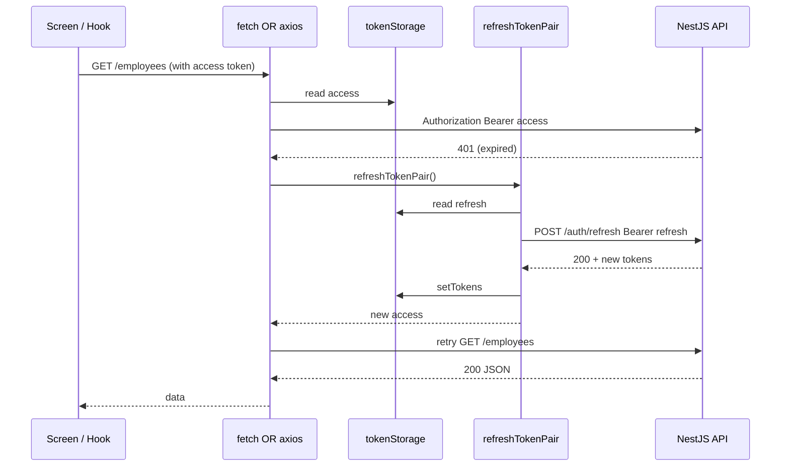
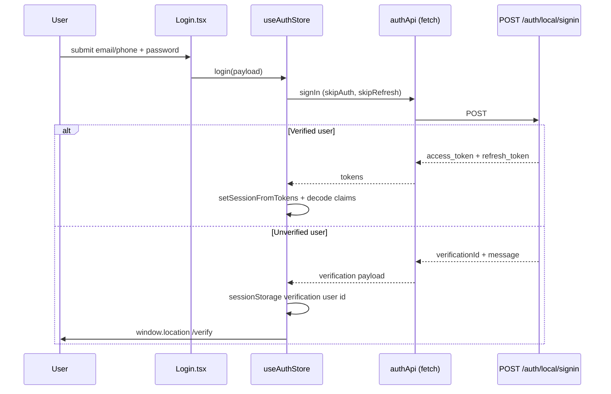

# HR Dashboard Frontend — Project Explanation

This document gives a **project-level overview** of the HR Dashboard single-page application (SPA). It is written for university or client presentations and assumes separation from the NestJS backend (see `back/FRONTEND_INTEGRATION_GUIDE.md`, `back/COMPLETE_API_REFERENCE.md`, `back/BACKEND_ARCHITECTURE.md`, and `back/swagger-spec.json`).

---

## 1. What this frontend does

The application is an **internal HR operations UI**: authenticated users view an overview dashboard, browse and manage employees (with role-gated writes), run simple analytics reports, and (for `SUPER_ADMIN`) manage user accounts. It communicates with a **remote REST API** (JWT access + refresh) over HTTPS; there is **no embedded backend** in this repository.

### Main business purpose

- Give HR staff a **single place** to monitor headcount-related signals, engagement-style metrics, and “alerts” derived from employee data.
- Support **directory workflows**: list, filter, sort, paginate employees; open a detail view from navigation state; create/update/delete when permitted.
- Expose **admin user management** only to super-admins, matching backend `RolesGuard` expectations.

### Main user roles (as consumed by the UI)

| Role | JWT claim | Typical UI access |
|------|-----------|-------------------|
| Admin | `ADMIN` | Dashboard, Employees, Reports, Settings; employee writes may still 403 per backend rules |
| Super Admin | `SUPER_ADMIN` | Above + **Users** route and sidebar link |

The UI reads `role` from the **access token payload** (decoded client-side for display and routing only — not for security enforcement; the API remains authoritative).

### Technologies

| Layer | Choice | Role |
|-------|--------|------|
| UI library | React 19 | Component model, concurrent features |
| Build / dev | Vite (rolldown-vite override) | Fast HMR, ESM-native dev |
| Routing | React Router 7 | `BrowserRouter`, nested layout routes |
| Styling | Tailwind CSS 3 + shadcn-style utilities (`cn`, CVA) | Utility-first layout |
| Components | Ant Design 6 | Tables, forms, feedback (`message`, `Modal`) |
| Charts | Recharts (via `ChartCard`) | Simple series visualization |
| Server state | TanStack React Query 5 | Query client defaults + optional hooks in `src/features/` |
| Client session | Zustand 5 | Auth slice, hydration from storage |
| HTTP | **Both** native `fetch` (`httpClient`) and **Axios** (`apiClient`) | See architecture note below |

### Architecture style

- **SPA** with **layout shell** (`MainLayout`: sidebar + navbar + `<Outlet />`).
- **Hybrid API layer**: a newer **fetch-based** client (`src/api/httpClient.ts`) with explicit 204 handling and `ApiError` normalization, and a **legacy/sibling Axios stack** (`src/lib/api.ts`) used by most screens for employees, dashboard, and reports.
- **Feature folders** (`src/features/*`) hold React Query hooks, but **several top-level screens still use local `useState` + imperative calls** to `@/lib/api` instead of those hooks.

### Why these technologies (as evidenced by the codebase)

- **Vite + React**: standard, fast local dev for a dashboard that is mostly CRUD + charts.
- **Ant Design**: rich `Table` with filters, pagination, and modals without building a design system from scratch.
- **React Query**: central place for retries, caching, and stale times; aligned with “dashboard” read patterns even where not all views use it yet.
- **Zustand**: minimal boilerplate for global auth (tokens + claims mirror) without prop drilling.
- **Dual HTTP clients**: Axios gives interceptors for the employee/dashboard module; `fetch` + `httpClient` gives a thin, typed path for auth resources and an alternative stack used by `authApi` / `employeesApi` in `src/api/resources/`.

---

## 2. Honest limitations (useful for defense Q&A)

1. **OTP verify vs tokens**: `POST /auth/verify` returns JWTs per backend docs, but `VerifyEmail.tsx` calls `verifyAccount` from `@/lib/api`, which **ignores the response** and sends the user back to login. A separate hook `useVerifyAccountMutation` **would** persist tokens via `authApi.verify`, but the screen does not use it.
2. **Users list and sensitive fields**: Backend may return `hashedPassword` (see backend docs). `usersApi.list` sanitizes; **`UsersList.tsx` uses `fetchUsers` from `@/lib/api`**, which does **not** apply `sanitizeUsersResponse` — a real privacy/security gap if those fields appear in JSON.
3. **Attendance / vacations**: DTO types exist in `src/types/dto.ts`, but **no pages** call `POST /attendance/punch`, `GET /vacations`, etc.
4. **React Query hooks** in `src/features/` are **not wired** into `Dashboard`, `EmployeesList`, `UsersList`, or `Reports` — those use imperative loading.

---

## 3. Full architectural summary

```text
Browser
  └── React app (Vite)
        ├── React Router (public auth routes + protected layout)
        ├── QueryClientProvider (React Query defaults)
        ├── Zustand auth store (tokens + decoded claims)
        └── UI routes
              ├── fetch stack: httpClient → refreshMutex → tokenStorage
              └── axios stack: apiClient interceptors → same refreshMutex + tokenStorage
```

Both stacks target the same **`getApiBaseUrl()`** (`VITE_API_URL` / `VITE_API_BASE_URL` / production default). Protected calls send **`Authorization: Bearer <access_token>`**. Refresh uses **`POST /auth/refresh`** with **`Bearer <refresh_token>`** (not the access token).

---

## 4. Request lifecycle (authenticated GET)



If refresh fails, **`emitSessionExpired()`** runs the handler registered by the auth store → **`clearSession()`** (and axios interceptor may redirect to `/login`).

---

## 5. Authentication lifecycle



Session **persistence**: tokens in `localStorage` by default, or `sessionStorage` if `VITE_AUTH_STORAGE === 'session'`.

---

## 6. Data flow lifecycle (employees list — actual implementation)

1. **`EmployeesList.tsx`** builds `EmployeesQueryParams` from Ant Design table state (pagination, filters, sorter).
2. **`fetchEmployees`** (`@/lib/api`) → **`mapEmployeesQueryToApi`** resolves human labels (e.g. department name) to **numeric FK IDs** and maps UI sort keys to **snake_case** Prisma fields (e.g. `monthlyIncome` → `monthly_income`).
3. **Axios** `GET /employees` returns `{ data, meta }`; rows are **mapped** through **`mapApiEmployeeToEmployee`** using **cached lookups** from `ensureLookups()` (`GET /lookups/*`).
4. Component stores **`Employee[]`** in React state; **React Query is not used** on this screen (unlike `useEmployeesQuery`, which calls `employeesApi.list` via `fetch`).

---

## 7. Complete frontend workflow: login → dashboard → API → logout

1. User opens `/login`, submits credentials → **`useAuthStore.login`** → **`authApi.signIn`** → tokens **or** redirect to `/verify` with stored `verificationId`.
2. **`ProtectedRoute`** calls **`initializeAuth()`**, reads tokens from storage, decodes access JWT for `email` / `role` / `userId`, sets `isAuthenticated`.
3. **`MainLayout`** renders **`Sidebar`** (role-filtered links) and **`Navbar`** (email, role, logout).
4. **Dashboard** mounts → **`fetchDashboardBundle`** loads **all employees** by paging `GET /employees` until `meta.total` is reached, then computes cards/charts **client-side** (with optional `GET /employees/stats` path inside **`fetchEmployeeStats`** for reports — tries API first, falls back to aggregated local data on error).
5. **Employees** uses **`GET /employees`** with query params; **mutations** use **`POST/PUT/DELETE /employees`** (super-admin only on server).
6. **Logout**: **`useAuthStore.logout`** calls **`POST /auth/logout`** with access token (204 expected), then **`clearSession()`** regardless of network outcome. Navbar navigates to `/login`.

---

## 8. Where to read next

| Topic | Document |
|-------|----------|
| Folders, components, routing | [FRONTEND_ARCHITECTURE.md](./FRONTEND_ARCHITECTURE.md) |
| Auth, mutex, token storage | [FRONTEND_AUTH_FLOW.md](./FRONTEND_AUTH_FLOW.md) |
| httpClient, APIs, errors | [FRONTEND_API_LAYER.md](./FRONTEND_API_LAYER.md) |
| Zustand vs React Query | [FRONTEND_STATE_MANAGEMENT.md](./FRONTEND_STATE_MANAGEMENT.md) |
| Guards, roles | [FRONTEND_SECURITY.md](./FRONTEND_SECURITY.md) |
| Screens vs endpoints | [FRONTEND_FEATURES.md](./FRONTEND_FEATURES.md) |
| Production risks | [FRONTEND_RUNTIME_ANALYSIS.md](./FRONTEND_RUNTIME_ANALYSIS.md) |

---

*Sources of truth for API contracts: `back/COMPLETE_API_REFERENCE.md`, `back/FRONTEND_INTEGRATION_GUIDE.md`, `back/swagger-spec.json`, and runtime code under `src/`.*
